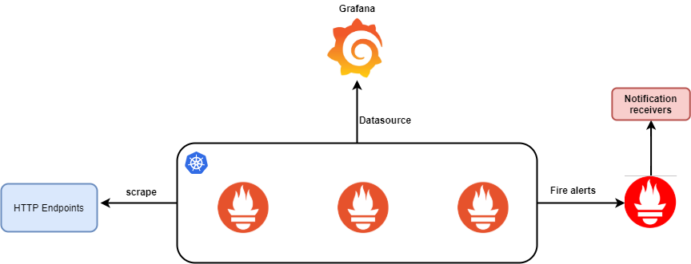

# Prometheus and Grafana Deployment - kubernetes 

Prometheus and Grafana are deployed on a Kubernetes cluster with three nodes. But this can be scaled by adding more nodes to the cluster and setting the replica set for the service to be auto scaled
The following directories have YAML configurations to deploy Prometheus and Grafana. Each of the YAML configuration submits a request to Kubernetes API server and creates resources based on the instruction 

Following steps are required to configure prometheus server as kubernetes deployment 

* Namespace 
* ConfigMap
* Deployment
* NodePort
* Volumes

## Namespace

All resources in the Kubernetes are launched in a namespace, and if no namespace is defined ‘default’ namespace is used. 

The command to apply this is

`kubectl apply -f monitoring-namespace.yaml`

Once this is applied, namespaces can be viewed with the command:

`kubectl get namespaces`

## ConfigMap

A ConfigMap in Prometheus provides configuration data to the Prometheus server. A pod can be consume congifMaps as environment variables, command-line arguments, or as configuration files in a volume 

In the data section of __Prometheus-configmap.yml__ file, the main Prometheus configuration is specified – global configurations, location of the rule files, alert manager configuration and scrape configs to monitor the target endpoints

The configMap doesn’t do anything by itself, but we’ll apply it so it’s available when we deploy prometheus later.

Config map can be apllied with the command,

`kubectl apply -f prometheus-config.yaml`

## Deployment 

Prometheus is deployed using __Prometheus-deployment.yml__ file and contains the following details,

* Replicas are the number of desired replicas to be deployed in the cluster. In this case it is 3 replicas
* Selector details how then ReplicaSet will know which pod its controlling 
* Spec contains the specification of how the container runs
    - __image__  is the docker image to be used 
    - __Ports__ specify where the port where the container runs
	- __VolumeMounts__ are volumes or directories mounted into the containers

Deployment comfiguration can be apllied with the command,

`kubectl apply -f prometheus-deployment.yaml`

## NodePort 

Nodeport  is a service which allows access to prometheus via node IP address

__Prometheus-service.yml__ is configuration file required to expose the Prometheus as service on the node and can be apllied using the command,

`kubectl apply -f prometheus-service.yaml`

## Volumes

Prometheus requires configuration or data to be stored in persistent volumes, so that its not lost when the pods are destroyed or offline

A persistent volume and persistent volume claim need to be configured for the Prometheus server to mount the volumes to store the configuration files or data and can be appliued using the command,

`kubectl apply -f prometheus-pv.yaml` & `kubectl apply -f prometheus-pvc.yaml`
